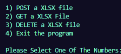

# Transcript-Parser

This software enables users to place a PDF of their transcript, which will output an XLSX file that displays
their graduation checklist. Note that these PDFs only work for students that are **computer science majors** or 
**information systems majors**. 

More about the program: This program is a **CLI** based software that prompts users to input a PDF of their choosing
for it to be **parsed**. The data that is parsed is then store onto **MongoDB** with the help of the **FastAPI** to handle user request handling as well as perform **CRUD** based operations 

# Technologies Used

These are the primary technologies that were used for making the project


- Python (with PIP)
- FastAPI
- MongoDB
- Docker
- Docker Compose 


**Ensure that these are installed onto your system.** 

Note that the installations will vary accross different operating systems, so follow
the steps for the operating system you are currently using. 

# (OPTIONAL) Setting up a Virtual Environment  

It is **HIGHLY RECOMMENDED** to set up a virtual environemnt to isolate the dependencies that mamy differ across projects. 
This will ensure that packages won't cause conflicts, if they were installed onto the machine directly. 


1) Create the virtual environemnt 

## On Windows 
```
python -m venv env
```

## Only Linux/macOS
```
python3 -m venv env
```

2) Activate the virtual environment 

## On Windows 
```
.\env\Scripts\activate
```

## Only Linux/macOS
```
source env/bin/activate
```

You may now install the necessary packages such that it won't be install system-wide on the virtual machine 

3) Deactivating the virtual environment 

Once you are done working, you can turn off the virutal environment by running the following:
```
deactivate
```

# Installing Necessary Packages 

Assuming you have all the technologies listed above installed, you can now run the following

```
pip install -r requirements.txt 
```

This will install of the necessary packages along with the specific versions and dependencies 


# Initializing The Server

Before running the main program, the program needs to set up a web server. This is so that when the user is in the main program, their transactions
can be successful through the use of a REST API. 

1) Start an additional terminal session 

2) Within the terminal, type the following in the command line


```
uvicorn tparser.src.backend.fast:app --reload --port=8000 --host=0.0.0.0
```

This sets up a FastAPI server that runs on your local machine. This is needed to ensure that user requests are fullfilled through API calls. 


Here is an example of a log message that shows the server started succesfully 


Once you have seen this message, you may start up the main program 


# Running The Program 

1) Put any transcripts you wish to parse in the folder labeled **input**

2) Go to the tparser folder and then into the src folder 

```
cd tparser/src/
```

3) Run the code in the module


```
python3 main.py
```

This will give the user a command line interface with **4 options:** 



- **CREATE** an XLSX file, where you can select **1**, which would prompt you
    to enter the PDF file to be parsed. After the file has been parsed, you may choose to **UPDATE** 
    the file if it already exists.

- **GET** an XLSX file, where you can select **2**, which would prompt you to enter 
    the name of the file that is stored on the backend. After selecting the name of the file, the file will appear in the **output** folder 

- **DELETE** an XLSX file, where you can select **3**, which would prompt them to enter the name of the file that is stored on the backend. After selecting the name of the file, not only will it delete the file on the backend, but if the file exists in the output directory, it will be deleted there as well. 

- **EXIT** the program. wnhere you can select **4**, which would terminate the program 


# Running The Program With Docker 


You can also run the program via docker

1) 
